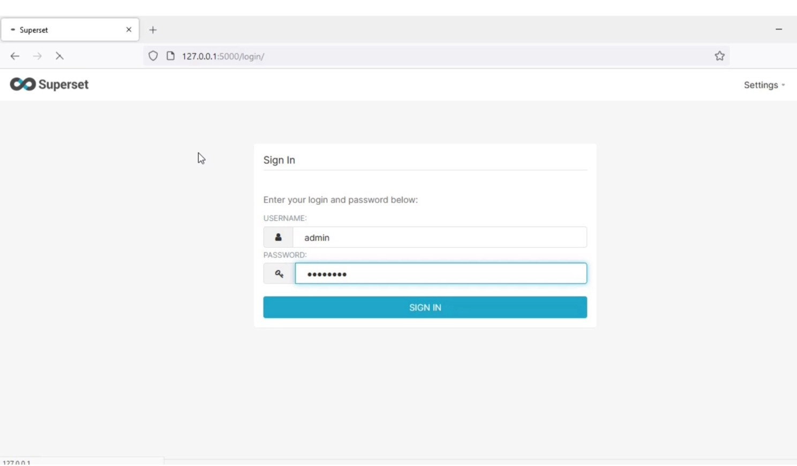
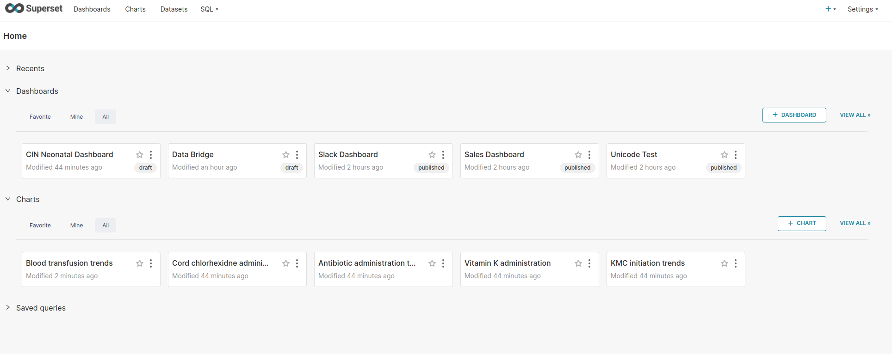
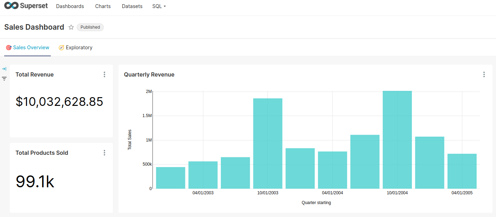
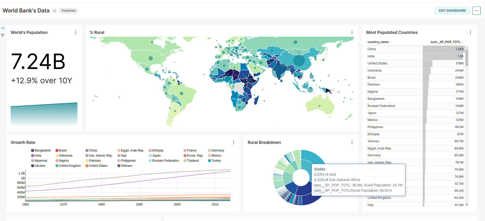

# Installing Superset from Scratch
## Superset installation guide
- Step-by-step instructions to install Superset for data visualization and business intelligence.

## Prerequisites for Installing Superset
Before installing Apache Superset, ensure your system meets the following prerequisites:

- Operating System Dependencies: Check the OS dependencies to ensure compatibility.
- Python Version: Use Python 3.9 or 3.10. Other versions may not be supported.

### Update your system:
    sudo apt update

### Install System Dependencies:

    sudo apt-get install build-essential libssl-dev libffi-dev python3-dev python3-pip libsasl2-dev libldap2-dev default-libmysqlclient-dev

    sudo apt-get install python3-setuptools

    pip3 install --upgrade pip

    pip3 install --upgrade setuptools pip

    pip install --upgrade setuptools pip

### Virtual Environment: It's recommended to use a virtual environment for Python to avoid conflicts with system packages. You can create one using:

    apt install python3.10-venv

    python3 -m venv supersetvenv

### Activate the virtual environment in which Apache Superset is installed:

    source supersetvenv/bin/activate

### Database Drivers: Install the necessary database drivers for the databases you wish to connect to Superset. For example, for MySQL or MariaDB, you might need:

    pip install mysqlclient

    pip install psycopg2

    pip install python-ldap

### Superset Installation: Install Superset using pip:

    pip install pillow

    pip install apache-superset

    export FLASK_APP=superset

    python3 -m pip install gevent

## Initialize the database and add a SECRET_KEY to your superset_config.py:
### Using SQLlite

    openssl rand -base64 42

    export SUPERSET_SECRET_KEY=XxaxaxaxaaauyuHTTTTyB2iJEUwNAP9irs4PGL2043VuPXxry+g9kUbJlDkHvbz9Pjv04wVfZ0     

### Using Postgres 
#### Two potential scenarios

#### Scenario A: You are starting from scratch and want to use Postgres instead of sqlite.

Install postgres
- Add postgres connection string to **superset_config.py** file
- Run **superset db upgrade** this will create all the tables on Postgres
- Run **superset init**
- Launch Superset

#### Scenario B: You have an already populated sqliteDB and want to migrate it to Postgres.

Install postgres
- Add postgres connection string to **superset_config.py** file
- Copy all tables from sqlite to postgres, many ways to do this. My preferred way is to do is to use ruby
- After you have copied your data run **superset db upgrade** and **superset init**
- After you have done this you will need to update key sequences on Postgres on table information_schema.sequences otherwise you will hit unique key conflicts errors.
- Launch Superset

**NB:** In both scenarios you should see the message below after you have run superset db upgrade this means you have configured your superset_config.py properly.:

Make sure superset is looking at the config file by setting the environment variables:

    export PYTHONPATH=/home/local_settings/:$PYTHONPATH

    OR export SUPERSET_CONFIG_PATH=/home/local_settings/

    e.g. export SUPERSET_CONFIG_PATH=/srv/venv/lib/python3.9/site-packages/superset/superset_config.py

 
### Database Initialization: Initialize the Superset database with:

    superset db upgrade

### Admin User Creation: Create an admin user to manage Superset:

    superset fab create-admin

### Data Loading: Optionally, load example data to explore Superset's features: Load some data to play with

    superset load_examples

### Role and Permission Setup: Set up default roles and permissions:

    superset init

### To start a development web server on port 8088, use -p to bind to another port

    superset run -p 8088 -h 0.0.0.0 --with-threads --reload --debugger

### Open the below URL in the Browser

    http://localhost:8088

### NB
If everything worked, you should be able to navigate to hostname:port in your browser (e.g. locally by default at localhost:8088) and login using the username and password you created.

## Login to Apache Superset on local host.

## Select Dashboard.

## Sample Dashboard.

  

# 
 ENJOY 

